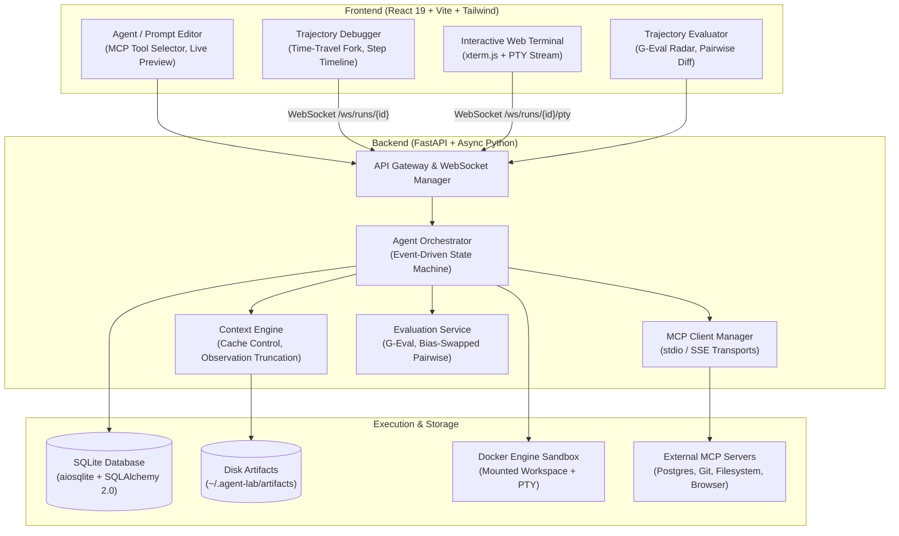
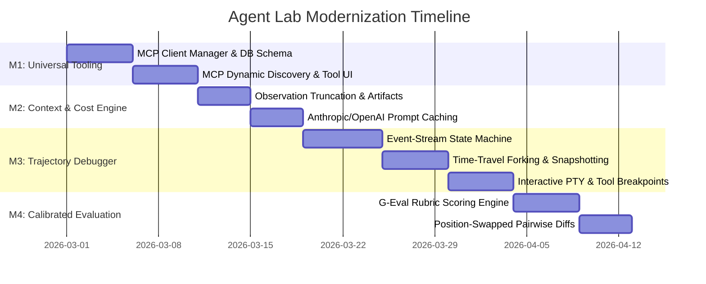

# Agent Lab 2.0: Architecture & Modernization Roadmap

> **Goal**: Transform Agent Lab into a production-grade developer platform and interactive harness for AI agents ("Postman + Chrome DevTools for AI Agents").
> 
> **Core Pillars**: Standard Tool Protocols (MCP) • Context Caching & Compaction • Interactive Trajectory Debugging • Calibrated Multi-Dimensional Evaluation.

---

## 1. System Architecture (Target State)



---

## 2. Strategic Milestones



---

## Milestone 1: Universal Tooling via Model Context Protocol (MCP)

### Objective
Deprecate proprietary tool stubs. Turn Agent Lab into an **MCP Host** capable of discovering and executing tools from any local (`stdio`) or remote (`sse`) MCP server.

### Backend Specification

#### Database Model (`backend/app/models.py`)
```python
class MCPServer(Base):
    __tablename__ = "mcp_servers"

    id: Mapped[str] = mapped_column(String(36), primary_key=True, default=lambda: str(uuid.uuid4()))
    name: Mapped[str] = mapped_column(String(100), unique=True, index=True)
    transport: Mapped[str] = mapped_column(String(20))  # "stdio" | "sse"
    command: Mapped[str | None] = mapped_column(String(255), nullable=True)
    args: Mapped[list[str] | None] = mapped_column(JSON, nullable=True)
    env: Mapped[dict[str, str] | None] = mapped_column(JSON, nullable=True)  # Fernet encrypted
    url: Mapped[str | None] = mapped_column(String(500), nullable=True)
    is_active: Mapped[bool] = mapped_column(Boolean, default=True)
    created_at: Mapped[datetime] = mapped_column(DateTime, default=func.now())
```

#### MCP Client Manager (`backend/app/services/mcp_service.py`)
- Manages an `AsyncExitStack` pool of active `mcp.ClientSession` instances.
- Handles dynamic tool schema discovery via `session.list_tools()`.
- Maps JSON Schema definitions into OpenAI and Anthropic tool formats.
- Routes LLM tool calls (`mcp__{server_name}__{tool_name}`) to `session.call_tool()`.

#### API Endpoints
- `GET /api/mcp/servers`: List configured servers and connection status.
- `POST /api/mcp/servers`: Register new server (validates connection on save).
- `GET /api/mcp/servers/{id}/tools`: List discovered tools with schemas.
- `DELETE /api/mcp/servers/{id}`: Unregister and terminate server process.

### Frontend Specification
- **MCP Server Manager** (`frontend/src/pages/SettingsPage.tsx` or new `MCPServersPage.tsx`):
  - Add standard presets (Postgres, GitHub, Filesystem, SQLite, Brave Search).
  - Status indicators (Connected / Disconnected / Error).
- **Agent Editor Integration**:
  - Tools tab lists detected MCP tools grouped by server name.
  - Interactive JSON Schema preview for each tool.

---

## Milestone 2: Cache-Aware Context & Token Engine

### Objective
Eliminate context window blowups and reduce API costs by 75–90% by optimizing for provider prompt caching and offloading voluminous tool outputs.

### Architecture & Mechanisms

```
[Tool Output] ─── (> 1500 tokens?) ───┬──► [Write full output to ~/.agent-lab/artifacts/]
                                      └──► [Inject Head/Tail + artifact:// URI to LLM]

[Message Assembly]
  ├── System Prompt + Skills ─────────► [cache_control: {"type": "ephemeral"}]
  ├── Static Tool Schemas ────────────► [cache_control: {"type": "ephemeral"}]
  └── Append-Only User/Assistant Turns ─► [Preserves prefix hash for cache hits]
```

### Technical Implementation

#### 1. Observation Truncation & Disk Artifacts
- Add `backend/app/services/context_engine.py`:
  - Enforces `MAX_OBSERVATION_TOKENS = 1500` (~4,000 characters).
  - Bulky logs (compiler outputs, large web pages, directory walks) write to:
    `~/.agent-lab/artifacts/{run_id}/{call_id}.log`.
  - The model receives:
    ```
    [Output truncated: 4,120 chars omitted. Stored: artifact://{run_id}/{call_id}]
    --- HEAD (first 10 lines) ---
    ...
    --- TAIL (last 10 lines) ---
    ...
    ```

#### 2. Provider Caching Implementation
- **Anthropic Provider** (`backend/app/services/llm/anthropic_provider.py`):
  - Injects `cache_control: {"type": "ephemeral"}` onto the system prompt block and the final tool definition.
- **Context Compaction Strategy**:
  - Avoid LLM-based narrative summarization of the entire conversation (which invalidates prefix caches).
  - When context reaches 80% capacity, selectively prune historical tool *observations* older than $N$ turns into `[Tool output cleared: see artifact]`, preserving reasoning chains and cache prefixes.

### Deliverables
- `ContextEngine` intercepting all tool responses before history insertion.
- Artifact download endpoint: `GET /api/runs/{id}/artifacts/{artifact_id}`.
- Frontend Cache Stats component showing:
  - Cache Read Tokens vs. Cache Write Tokens.
  - Calculated dollar savings per run.

---

## Milestone 3: Interactive Trajectory Debugger & Time-Travel Forking

### Objective
Transform the run experience from a passive streaming log into an interactive, step-by-step debugger with breakpoints, tool approvals, and the ability to branch/fork runs from past steps.

### Architecture & Mechanics

```
Execution Trajectory (Immutable Event Stream):
[Event 0: User Goal]
    │
[Event 1: LLM Thought]
    │
[Event 2: Action (Tool Call)] ───► [Risk Match?] ──► [Breakpoint: AWAITING_APPROVAL]
    │                                                      │
[Event 3: Observation] ◄────────────────────────────── (User Approves)
    │
    ├──────── (User chooses "Fork at Step 3")
    │             │
    │             └──► Clone Events 0..3 ──► Rollback Workspace ──► [New Run / Alternative Model]
    ▼
[Event 4: Action]
```

### Technical Implementation

#### 1. Typed Event Stream (`backend/app/models.py`)
```python
class TrajectoryEvent(Base):
    __tablename__ = "trajectory_events"

    id: Mapped[str] = mapped_column(String(36), primary_key=True, default=lambda: str(uuid.uuid4()))
    run_id: Mapped[str] = mapped_column(ForeignKey("runs.id"), index=True)
    step_index: Mapped[int] = mapped_column(Integer)
    event_type: Mapped[str] = mapped_column(String(30))  # "thought" | "action" | "observation" | "system"
    payload: Mapped[dict] = mapped_column(JSON)
    created_at: Mapped[datetime] = mapped_column(DateTime, default=func.now())
```

#### 2. Workspace Checkpoint Engine (`backend/app/services/sandbox.py`)
- Uses Git-backed or directory snapshot versioning on host-side agent workspace directories (`~/.agent-lab/workspaces/{agent_id}/{run_id}`).
- Commits a snapshot tag `step_{n}` after any tool execution that mutates the filesystem.

#### 3. Time-Travel Fork API (`backend/app/routers/runs.py`)
- `POST /api/runs/{id}/fork`:
  - Params: `step_index: int`, `override_model: str | None`, `override_prompt: str | None`.
  - Clones trajectory events $0 \dots n$ into a new run record.
  - Resets the workspace directory to `step_{n}`.
  - Launches execution from step $n+1$ in a new sandboxed container.

#### 4. Interactive Breakpoints & Human-in-the-Loop (HITL)
- Orchestrator checks tool calls against safety filters (destructive bash, database drops, external network calls).
- Matches trigger run state `AWAITING_APPROVAL`.
- REST endpoints:
  - `POST /api/runs/{id}/approve`
  - `POST /api/runs/{id}/reject` (injects user rejection explanation back into agent context).

#### 5. Interactive PTY Attach
- Expose WebSocket endpoint `/ws/runs/{id}/pty`.
- Bridges an interactive bash PTY directly into the running Docker container via `client.api.exec_create(..., stdin=True, tty=True)` and `exec_start()`.
- Frontend embeds `xterm.js` in a drawer on `RunDashboardPage` to let developers inspect or tweak the container workspace live.

---

## Milestone 4: Calibrated Trajectory Evaluation & G-Eval Benchmarking

### Objective
Replace scalar 1–10 single-output grading with calibrated, multi-dimensional trajectory auditing that scores planning efficiency, tool accuracy, and error recovery while neutralizing LLM judge biases.

### Technical Implementation

#### 1. Multi-Dimensional Metric Extraction (`backend/app/services/evaluator.py`)
```python
class TrajectoryMetrics(BaseModel):
    total_steps: int
    tool_call_count: int
    redundant_call_count: int      # Same tool called with identical args
    tool_error_count: int          # Tool calls returning errors or non-zero exit codes
    recovery_rate: float           # Successfully corrected errors / total errors
    tokens_consumed: int
    wall_clock_time_seconds: float
```

#### 2. Calibrated G-Eval Judge
The LLM Judge evaluates the structured trajectory across three explicit rubric dimensions:
1. **Planning & Grounding** (1–5): Did the agent follow an evidence-based plan without thrashing or circular exploration?
2. **Tool Accuracy & Argument Precision** (1–5): Did the agent format arguments correctly without hallucinated parameters?
3. **Autonomous Recovery** (1–5): How effectively did the agent diagnose and resolve tool errors?

#### 3. Position-Swapped Pairwise Comparison (Bias Mitigation)
When comparing Run A against Run B on `CompareRunsPage`:
- **Trial 1**: `Judge(Candidate_A, Candidate_B)`
- **Trial 2**: `Judge(Candidate_B, Candidate_A)`
- Verdict logic:
  - Both trials agree $\rightarrow$ **Statistically Valid Winner** (confidence: high).
  - Verdict flips with order $\rightarrow$ Flagged as **Position Biased / Inconclusive**.

#### 4. Frontend Visualizations
- **Trajectory Divergence Diff**: Side-by-side timeline view highlighting the exact turn where two runs selected different tools or diverged in logic.
- **Evaluation Radar Chart**: Visual breakdown of Planning vs. Tool Precision vs. Recovery vs. Efficiency.

---

## 3. Gating Tests & Verification Criteria (Milestone Gates)

Before proceeding to the next milestone, every test in the corresponding gate must pass empirically.

### Milestone 1 Gate: Universal Tooling (MCP)
> **Gating Rule**: An agent must autonomously discover, validate, and execute a tool from an external MCP server in an end-to-end sandbox run before starting Milestone 2.

| Test ID | Test Target | Verification Command / Scenario | Pass Criteria |
| :--- | :--- | :--- | :--- |
| **M1-T1** | MCP Server Handshake | `pytest tests/test_mcp.py::test_mcp_stdio_connection` | `session.initialize()` completes; server status transitions to `CONNECTED`. |
| **M1-T2** | Tool Schema Extraction | `pytest tests/test_mcp.py::test_tool_schema_conversion` | `session.list_tools()` parses into valid JSON Schemas compatible with OpenAI & Anthropic specs. |
| **M1-T3** | Error Handling & Trapping | `pytest tests/test_mcp.py::test_tool_execution_error_handling` | Tool failure returns `isError=True` inside a structured JSON payload; zero unhandled 500 exceptions. |
| **M1-T4** | **E2E Agent MCP Run** | Run an agent configured with `@modelcontextprotocol/server-sqlite` via `POST /api/runs` | Agent selects MCP tool, executes query, receives observation, and finishes with status `COMPLETED`. |

---

### Milestone 2 Gate: Cache-Aware Context & Token Engine
> **Gating Rule**: Prompt caching and observation offloading must achieve $\ge 75\%$ cache hit rates and zero context overflows under synthetic load before starting Milestone 3.

| Test ID | Test Target | Verification Command / Scenario | Pass Criteria |
| :--- | :--- | :--- | :--- |
| **M2-T1** | Observation Truncation | `pytest tests/test_context.py::test_observation_truncation` | Output $> 1,500$ tokens truncated to head/tail format; full content written to disk at `~/.agent-lab/artifacts/`. |
| **M2-T2** | Artifact Retrieval API | `curl -f http://localhost:8000/api/runs/{id}/artifacts/{call_id}` | Returns HTTP 200 with original untruncated content. |
| **M2-T3** | Cache Control Headers | `pytest tests/test_context.py::test_anthropic_cache_headers` | System prompt, skills, and tools contain `cache_control: {"type": "ephemeral"}` blocks. |
| **M2-T4** | **Empirical Caching Benchmark** | Run 4-turn task: `python scripts/benchmark_caching.py` | `usage.cache_read_input_tokens / usage.input_tokens >= 0.75` on turns 2, 3, and 4. |
| **M2-T5** | Deletion Compaction | `pytest tests/test_context.py::test_compaction_at_80_percent` | At 80% context window, older tool observations prune to `[Tool output cleared]`; instructions and reasoning intact. |

---

### Milestone 3 Gate: Trajectory Debugger & Time-Travel
> **Gating Rule**: Forked runs must maintain zero workspace state contamination, and dangerous commands must reliably halt on breakpoints before starting Milestone 4.

| Test ID | Test Target | Verification Command / Scenario | Pass Criteria |
| :--- | :--- | :--- | :--- |
| **M3-T1** | Event Stream Persistence | `pytest tests/test_trajectory.py::test_event_stream_integrity` | Every turn writes immutable `thought`, `action`, and `observation` records to `trajectory_events`. |
| **M3-T2** | Workspace Checkpointing | `pytest tests/test_sandbox.py::test_step_snapshot_creation` | Filesystem modification produces snapshot tag `step_{n}`; reverting to tag restores byte-identical tree. |
| **M3-T3** | **Time-Travel Fork Isolation** | `POST /api/runs/{id}/fork?step_index=2` | Forked run inherits events $0 \dots 2$; mutations in forked run do not alter parent workspace or events. |
| **M3-T4** | **Safety Breakpoint Interception** | Trigger tool call with command `rm -rf /workspace/test` | Run halts in state `AWAITING_APPROVAL`; tool does not execute until `POST /api/runs/{id}/approve`. |
| **M3-T5** | Interactive PTY Stream | Connect WebSocket to `/ws/runs/{id}/pty` and send `whoami\n` | PTY returns container stdout stream with low latency ($< 50\text{ms}$). |

---

### Milestone 4 Gate: Calibrated Trajectory Evaluation
> **Gating Rule**: Evaluator must detect synthetic failure modes with 100% accuracy and flag order-inconsistent evaluations before release.

| Test ID | Test Target | Verification Command / Scenario | Pass Criteria |
| :--- | :--- | :--- | :--- |
| **M4-T1** | Deterministic Trace Metrics | `pytest tests/test_evaluator.py::test_deterministic_metrics` | Trajectory with 2 duplicate calls and 1 error correctly outputs `redundant_calls=2`, `tool_errors=1`. |
| **M4-T2** | G-Eval Rubric Validation | `pytest tests/test_evaluator.py::test_geval_schema` | LLM Judge returns validated scores (1.0–5.0) for Planning, Tool Precision, and Recovery + rationale string. |
| **M4-T3** | **Position-Swapped Bias Detector** | `pytest tests/test_evaluator.py::test_position_swap_bias` | When Judge(A, B) $\neq$ Judge(B, A), result is flagged `POSITION_BIASED` / `INCONCLUSIVE` instead of picking false winner. |
| **M4-T4** | **Synthetic Loop Trap Test** | Run batch evaluation on agent prompted into an infinite loop | Evaluator gives Planning $\le 2.0$ and flags redundant loops in 100% of test runs. |
| **M4-T5** | Trajectory Diff Visualizer | Open `CompareRunsPage` with two divergent runs | UI highlights the exact turn where tool names or arguments diverged. |
