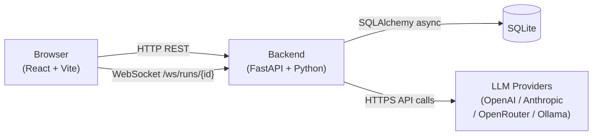

# Architecture

> Agent Lab is a local-first, self-contained developer tool. All data stays on your machine — SQLite database, no cloud sync, no telemetry.

---

## System Overview



---

## Services

| Service | Port | Technology | Purpose |
|---|---|---|---|
| `frontend` | 5173 | React 18, Vite, shadcn/ui, Tailwind | Browser UI |
| `backend` | 8000 | Python 3.11, FastAPI, SQLAlchemy 2.0 | REST API + WebSocket |
| SQLite | — | SQLite 3 (async via aiosqlite) | Persistent local storage |

---

## Directory Structure

```
agent-lab/
├── backend/
│   ├── app/
│   │   ├── main.py              # FastAPI app + CORS + lifespan
│   │   ├── config.py            # Settings from environment variables
│   │   ├── database.py          # Async engine + session factory
│   │   ├── models.py            # SQLAlchemy ORM models
│   │   ├── schemas.py           # Pydantic request/response schemas
│   │   ├── routers/
│   │   │   ├── agents.py        # Agent CRUD + export
│   │   │   ├── runs.py          # Run lifecycle
│   │   │   ├── skills.py        # Skill CRUD
│   │   │   ├── settings.py      # API key management
│   │   │   └── ws.py            # WebSocket log streaming
│   │   └── services/
│   │       ├── orchestrator.py  # Agent execution engine
│   │       ├── export_generators.py  # Python/FastAPI/Docker export
│   │       └── llm/             # LLM provider abstraction layer
│   │           ├── factory.py
│   │           ├── openai_provider.py
│   │           ├── anthropic_provider.py
│   │           └── openrouter_provider.py
│   ├── requirements.txt
│   └── Dockerfile
├── frontend/
│   ├── src/
│   │   ├── App.tsx              # Routes + ErrorBoundary
│   │   ├── lib/api.ts           # Typed HTTP client
│   │   ├── pages/              # Page-level components
│   │   └── components/         # Shared UI components + layout
│   ├── index.html
│   └── Dockerfile
├── docs/                        # This documentation
│   ├── architecture.md
│   ├── api-reference.md
│   └── troubleshooting.md
├── .env.example
├── install.sh
└── docker-compose.yml
```

---

## Data Model

### `agents`
| Column | Type | Notes |
|---|---|---|
| `id` | string (UUID) | Primary key |
| `name` | string(255) | Required |
| `description` | text | Optional |
| `system_prompt` | text | Baked into LLM context |
| `tools_config` | text (JSON) | Array of enabled tool names |
| `constraints_config` | text (JSON) | `{max_tokens, timeout, budget}` |
| `provider` | string(50) | `openai`, `anthropic`, `openrouter`, `ollama` |
| `model` | string(100) | e.g. `gpt-4o`, `claude-3-5-sonnet-20241022` |
| `created_at` | datetime | Auto-set |
| `updated_at` | datetime | Auto-updated |

### `runs`
| Column | Type | Notes |
|---|---|---|
| `id` | string (UUID) | Primary key |
| `agent_id` | string (FK) | `→ agents.id` (cascade delete) |
| `task` | text | User's task description |
| `status` | string(20) | `pending` → `running` → `completed` / `failed` |
| `cost` | float | Total USD cost (null until completed) |
| `total_tokens` | int | Input + output tokens (null until completed) |
| `duration_seconds` | float | Wall clock time (null until completed) |
| `error_message` | text | Set only on failure |
| `created_at` | datetime | Auto-set |
| `completed_at` | datetime | Set on run end |

### `run_logs`
| Column | Type | Notes |
|---|---|---|
| `id` | int (auto) | Primary key |
| `run_id` | string (FK) | `→ runs.id` (cascade delete) |
| `timestamp` | datetime | When the log was written |
| `level` | string(10) | `info`, `warning`, `error`, `debug` |
| `message` | text | Log message |
| `metadata_json` | text (JSON) | Extra data (token counts, etc.) |

### `skills`
| Column | Type | Notes |
|---|---|---|
| `id` | string (UUID) | Primary key |
| `name` | string(255) | Required |
| `description` | text | Optional |
| `instructions` | text | The actual skill content injected into prompts |
| `created_at` / `updated_at` | datetime | Auto-managed |

### `agent_skills` (junction)
| Column | Type | Notes |
|---|---|---|
| `agent_id` | string (FK) | Composite PK |
| `skill_id` | string (FK) | Composite PK |

---

## Real-Time Log Streaming

All agent runs emit logs over WebSocket so the UI can show live output:

1. Frontend opens **`ws://localhost:8000/ws/runs/{run_id}`**
2. Backend immediately sends any **existing logs** for the run (for reconnects)
3. As the orchestrator produces new logs, backend polls and sends them as:
   ```json
   { "type": "log", "data": { "level": "info", "message": "...", "timestamp": "..." } }
   ```
4. On run completion or failure, backend sends:
   ```json
   { "type": "status", "run": { "status": "completed", "cost": 0.0014, ... } }
   ```
   then closes the connection.

---

## Run Lifecycle

```
POST /api/runs
    │
    ▼
Run created (status: "pending")
    │
    ▼  [FastAPI BackgroundTask]
AgentOrchestrator.execute_run()
    │
    ├─ status → "running"
    ├─ calls LLM provider (streaming)
    ├─ writes RunLog entries to DB
    │
    ▼
status → "completed" / "failed"
cost, total_tokens, duration_seconds set
```

---

## Security

- **API keys**: Stored encrypted in SQLite using `cryptography` Fernet symmetric encryption
- **No key exposure**: API key values are **never** returned in any API response
- **Local-only**: No external telemetry, analytics, or cloud sync
- **CORS**: Backend only allows requests from the configured frontend URL
