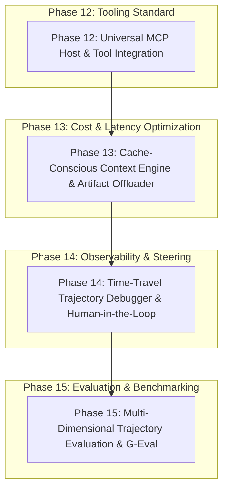

# SOTA Implementation Plan: Modernizing Agent Lab

> **Document Version**: 1.0  
> **Status**: Ready for Execution  
> **Target Milestones**: Phase 12 – Phase 15  
> **Applicable Stack**: FastAPI (async), SQLAlchemy 2.0, React 19, Vite, Tailwind CSS, Docker Engine, Model Context Protocol (MCP)

---

## 1. Strategic Roadmap Overview

To evolve Agent Lab from a standard prototype playground into a production-grade developer platform ("Postman for AI Agents"), four core capabilities are scheduled across sequential phases.



---

## 2. Phase Breakdown & Engineering Specifications

### Phase 12: Model Context Protocol (MCP) Universal Host Integration

#### 1. Objective & Target
Transform Agent Lab into an **MCP Host**. Allow users to register local (`stdio`) and remote (`sse` / `streamable_http`) MCP servers via UI, dynamically inspect available tools and schemas, and expose them directly to sandboxed agents without writing custom Python wrappers.

#### 2. Affected Files & Modules
- `backend/requirements.txt`: Add `mcp>=1.2.0`
- `backend/app/models.py`: Add `MCPServer` ORM model
- `backend/app/schemas.py`: Add `MCPServerCreate`, `MCPServerRead`, `MCPToolInfo`
- `backend/app/services/mcp_service.py` *(New)*: Client session lifecycle manager
- `backend/app/routers/mcp.py` *(New)*: Server configuration and tool discovery endpoints
- `backend/app/services/orchestrator.py`: Tool discovery & delegation bridge
- `frontend/src/lib/api.ts`: API client functions for MCP servers
- `frontend/src/pages/MCPSettingsPage.tsx` *(New)*: Configuration UI
- `frontend/src/components/agent-editor/ModelProviderSettings.tsx`: Tool assignment checkboxes

#### 3. Database Schema
```python
# backend/app/models.py
class MCPServer(Base):
    __tablename__ = "mcp_servers"

    id: Mapped[str] = mapped_column(String(36), primary_key=True, default=lambda: str(uuid.uuid4()))
    name: Mapped[str] = mapped_column(String(100), unique=True, index=True)
    transport: Mapped[str] = mapped_column(String(20))  # "stdio" | "sse"
    command: Mapped[str | None] = mapped_column(String(255), nullable=True)
    args: Mapped[list[str] | None] = mapped_column(JSON, nullable=True)
    env: Mapped[dict[str, str] | None] = mapped_column(JSON, nullable=True)  # Fernet encrypted
    url: Mapped[str | None] = mapped_column(String(500), nullable=True)
    is_active: Mapped[bool] = mapped_column(Boolean, default=True)
    created_at: Mapped[datetime] = mapped_column(DateTime, default=func.now())
```

#### 4. Execution Logic
1. On agent run initialization, `mcp_service.get_client_session(server_id)` starts or reuses connection.
2. `session.list_tools()` fetches JSON Schemas.
3. Schemas are converted into standard provider tool formats (e.g. OpenAI `{"type": "function", "function": ...}`).
4. When LLM emits `tool_calls`, the orchestrator routes calls matching `mcp_{server_name}_{tool_name}` to `session.call_tool(tool_name, arguments)`.

#### 5. Acceptance Criteria
- [ ] Connects to official SQLite, Filesystem, and GitHub MCP servers over `stdio`.
- [ ] Connects to remote HTTP/SSE MCP endpoints.
- [ ] Discovered tools appear in the Agent Editor with full JSON schema validation.
- [ ] Sandbox agent invokes MCP tools and receives structured JSON responses.

---

### Phase 13: Cache-Conscious Context Engine & Observation Offloader

#### 1. Objective & Target
Prevent context window explosion and reduce token costs by 75–90% by optimizing for Anthropic and OpenAI prompt caching boundaries, enforcing observation truncation, and offloading bulky tool outputs to disk artifacts.

#### 2. Affected Files & Modules
- `backend/app/services/context_engine.py` *(New)*: Token counter, truncation, and compaction algorithms
- `backend/app/services/llm/anthropic_provider.py`: Ephemeral cache control headers
- `backend/app/services/llm/openai_provider.py`: Prefix stabilization formatting
- `backend/app/services/orchestrator.py`: Tool result interception and artifact creation
- `backend/app/routers/runs.py`: Artifact download endpoints
- `frontend/src/pages/RunDashboardPage.tsx`: Cache hit rate visualization & artifact preview modal

#### 3. Core Algorithms & Rules
1. **Observation Truncation**:
   - Limit tool output to 1,500 tokens / 4,000 characters.
   - If output exceeds threshold:
     - Persist full output to `~/.agent-lab/artifacts/{run_id}/observation_{call_id}.log`.
     - Inject truncated excerpt into message stream:
       ```
       [Observation truncated: 3,240 characters omitted. Full log: artifact://{call_id}]
       Head:
       {first_10_lines}
       ...
       Tail:
       {last_10_lines}
       ```
2. **Anthropic Prompt Cache Breakpoints**:
   - Tag system prompt, static skills, and MCP tool definitions with `cache_control: {"type": "ephemeral"}`.
   - Keep conversation history append-only to preserve prefix hashes across sequential LLM turns.
3. **Observation Pruning at 80% Window**:
   - Rather than summarizing history with an LLM call (which breaks prompt cache prefixes), selectively prune tool observations older than 5 turns to `[Prior observation cleared]`, retaining all thought blocks and user messages.

#### 4. Acceptance Criteria
- [ ] Token usage tracking confirms 80%+ cache read hit rate on Anthropic runs $\ge 3$ turns.
- [ ] Large bash and search tool outputs are automatically offloaded to artifacts on disk.
- [ ] Users can click inline artifact links in the frontend log stream to view complete outputs in a slide-over sheet.

---

### Phase 14: Time-Travel Trajectory Debugger & Human-in-the-Loop Steering

#### 1. Objective & Target
Implement the core "Postman/DevTools for Agents" workflow: convert execution logs into an immutable Event Stream, enable mid-run pause/resume, implement interactive approval for risky tool calls, and allow developers to rewind to step $N$, edit inputs/tools, and fork execution.

#### 2. Affected Files & Modules
- `backend/app/models.py`: Add `TrajectoryEvent` model (Action/Observation)
- `backend/app/services/orchestrator.py`: Event-driven state machine (`RUNNING`, `PAUSED`, `AWAITING_APPROVAL`)
- `backend/app/services/sandbox.py`: Workspace snapshotting via copy-on-write / git commit per step
- `backend/app/routers/runs.py`: Endpoints for pause, resume, approve, reject, and fork
- `frontend/src/pages/RunDashboardPage.tsx`: Interactive step timeline, pause/resume buttons, approval modal, and "Fork from Step" action

#### 3. State Machine & Event Flow
```
[User Task]
    │
    ▼
[State: RUNNING] ─── (Matches Risk Rule) ───► [State: AWAITING_APPROVAL]
    │                                                   │
    │                                           ┌───────┴───────┐
    │                                           ▼               ▼
    │                                      (Approved)       (Rejected)
    │                                           │               │
    ▼                                           ▼               ▼
[Step Executed] ───► [Snapshot Workspace] ──► [Log Event] ──► [Next Step]
    │
    └── (User clicks "Fork @ Step 3") ──► Clone events 0..3 ──► Restore snapshot 3 ──► New Run
```

#### 4. API Endpoints
- `POST /api/runs/{id}/pause`: Pauses orchestrator before next tool execution.
- `POST /api/runs/{id}/resume`: Resumes paused run.
- `POST /api/runs/{id}/approve`: Approves pending tool call.
- `POST /api/runs/{id}/reject`: Returns user cancellation message to LLM loop without executing tool.
- `POST /api/runs/{id}/fork`:
  - Request body: `{"step_index": int, "modified_prompt": str | None}`
  - Spawns a new Run, restores the filesystem workspace state at `step_index`, deep-copies trajectory events $0 \dots n$, and launches the new trajectory.

#### 5. Acceptance Criteria
- [ ] Agent pauses and alerts frontend when executing configured critical tools (e.g. destructive commands).
- [ ] Developer can fork an existing run at any historical turn.
- [ ] The forked run starts with the exact filesystem and context state of that historical turn without re-running turns $0 \dots n$.

---

### Phase 15: Multi-Dimensional Trajectory Evaluation & Calibrated G-Eval

#### 1. Objective & Target
Upgrade the current simplistic single-number evaluator (`evaluator.py`) into a calibrated, multi-dimensional trajectory evaluator that assesses agent efficiency, tool accuracy, recovery capability, and mitigates LLM judge position bias.

#### 2. Affected Files & Modules
- `backend/app/schemas.py`: `TrajectoryEvaluationReport`, `TrajectoryMetrics`
- `backend/app/services/evaluator.py`: G-Eval Chain-of-Thought rubric prompts and deterministic metric computation
- `backend/app/routers/test_suites.py`: Trajectory-level test runner endpoints
- `frontend/src/pages/TestSuiteDetailsPage.tsx`: Multi-dimensional radar/bar charts for metrics
- `frontend/src/pages/CompareRunsPage.tsx`: Step-by-step trajectory diff visualizer with divergence detection

#### 3. Evaluation Dimensions & Bias Calibration
1. **Deterministic Trace Metrics**:
   - Steps to completion.
   - Redundant tool calls (identical tool + identical arguments).
   - Tool error frequency and hallucinated tool names.
2. **G-Eval Rubric Scoring (LLM Judge)**:
   - *Planning & Grounding* (1–5): Did the agent follow an evidence-based plan?
   - *Error Recovery* (1–5): Did the agent adapt correctly when a tool returned non-zero exit codes?
3. **Position-Swapped Pairwise Comparison**:
   - Compare Run A vs. Run B:
     $$\text{Trial 1} = \text{Judge}(A, B), \quad \text{Trial 2} = \text{Judge}(B, A)$$
   - If verdicts conflict, flag as `POSITION_BIASED` and record positional drift in analytics.

#### 4. Acceptance Criteria
- [ ] Test suite executions report Planning, Tool Accuracy, and Recovery scores separately from Task Completion.
- [ ] Side-by-side run comparison highlights the exact turn where two runs diverged in tool choices.
- [ ] Pairwise run comparisons automatically run position-swap trials to guarantee impartial evaluation.

---

## 3. Implementation Sequence & Dependencies

| Phase | Title | Pre-requisites | Estimated Effort |
| :--- | :--- | :--- | :--- |
| **Phase 12** | Universal MCP Host Integration | None (Standard Python SDK) | 3 Sprints |
| **Phase 13** | Context Engine & Observation Offloader | Phase 12 (Tool outputs standard) | 2 Sprints |
| **Phase 14** | Trajectory Debugger & HITL Steering | Phase 13 (Controlled context/artifacts) | 4 Sprints |
| **Phase 15** | Trajectory Evaluation & G-Eval | Phase 14 (Typed event trajectories) | 3 Sprints |

---

## 4. Verification Protocol

1. **Unit & Integration Tests**:
   - Every MCP transport (`stdio` / `sse`) must have mock server test coverage.
   - Context engine truncation must guarantee zero prompt overflows under synthetic 50,000-token tool outputs.
   - Trajectory forking must verify byte-level workspace isolation between parent and child runs.
2. **Empirical Benchmarking**:
   - Execute a 5-step test agent using Anthropic Claude 3.7:
     - Verify API cost is reduced by $\ge 70\%$ via prompt cache hits on turns 2–5.
   - Run a batch of 10 test cases in parallel, verifying that the G-Eval evaluator catches intentionally injected infinite tool loops.
